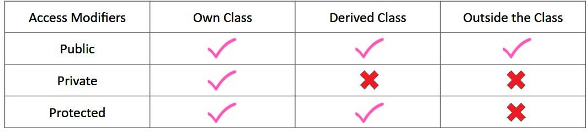

# Encapsulation
* Hiding “sensitive” data from the user. 
* Encapsulation is achieved in C++ using Classes.

#### Classes have two main components:
* Data Members
* Member Function

## Access Modifiers:
* Access modifiers are keywords in object-oriented languages that set the accessibility of classes, methods, and other members.
* Access modifiers are used to facilitate the encapsulation of components.

#### There are 3 types of Access Modifiers:
* Public: Class objects can access the data members and function outside the class.
* Private: Objects cannot access the data members and function outside the class. These members can only be accessed inside the class.
* Protected: Objects cannot access the data members and function outside the class. These members can be accessed inside the class and inherited class.

## Advantages of Encapsulation:
-	Good coding practice, useful in interviews
-	Increased security of data

