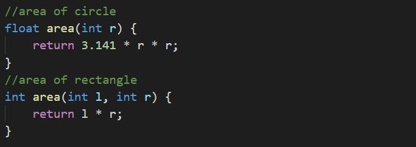
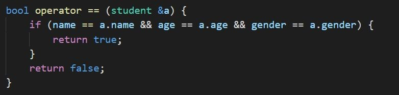

# Polymorphism
Polymorphism in C++ means, the same entity (function or object) behaves differently in different scenarios.

## Function Overloading
* Functions having the same name but different definitions. 
* The invoked function would depend on the arguments you pass to the functions.
* area(5) //for circle
* area(5, 10) //for rectangle

## Operator overloading
We can overload operators( == , + , - ,etc), to work on class objects.

In the above code snippet, we can compare two class objects using ==. Example: Student object a,b, we can compare from a == b.

